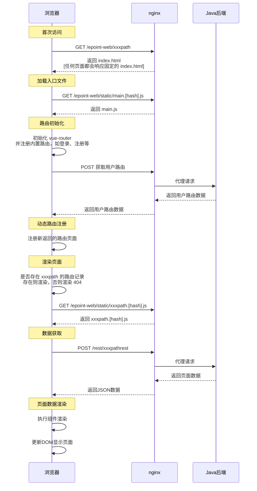

> 📖 **原文档地址**: [点击查看线上文档](http://192.168.219.170/docs/vue/latest/frame/getting-started/basic-concepts/)

## SPA

SPA，全称为 **Single-Page Application（单页应用程序）**，是一种特殊的 Web 应用开发架构。与您熟悉的“每个页面都是一个独立 HTML 文件”的传统 Web 应用不同，SPA **从服务器加载一个初始的 HTML 页面后，后续的页面跳转几乎不再重新请求完整的新 HTML 页面**。

点击 [单页应用 (SPA)](../guides/guides-spa.md) 了解更多。

SPA 图示：

