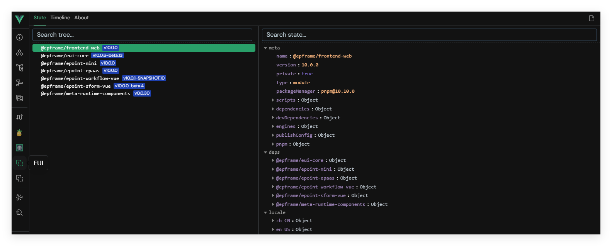
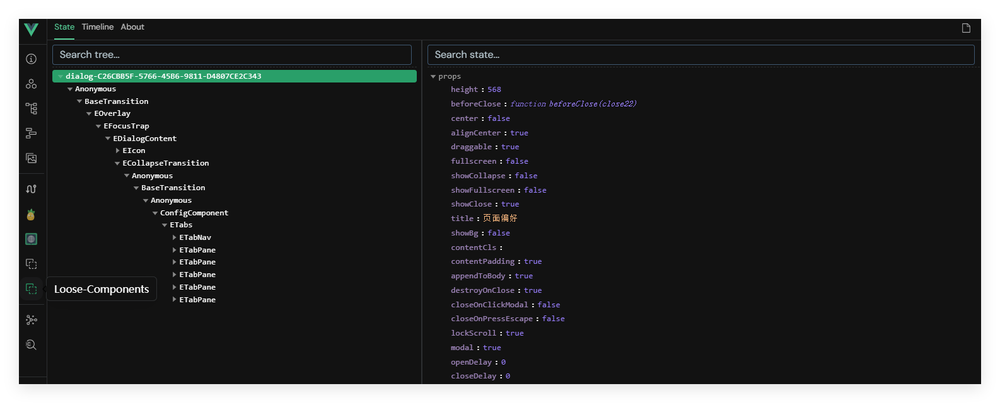

> 📖 **原文档地址**: [点击查看线上文档](http://192.168.219.170/docs/vue/latest/frame/guides/advanced/devtools-plugin/)

## 简介

- `@epoint-fe/devtools-plugin` 是配合 Vue DevTools 的调试插件，用于可视化查看工程所依赖的组件包信息与运行期的弹窗组件状态。
- 通过它，开发者可以快速定位依赖、国际化、页面注册、全局组件/指令，以及弹窗组件的挂载与通信情况，提高排错与联调效率。

## 安装

```bash
pnpm add -D @epoint-fe/devtools-plugin
```

## 注册

在 web 工程的 `src/setup.js` 中注册：
```js
import { Utils } from '@epframe/eui-core';
import { registerDevtools } from '@epoint-fe/devtools-plugin';

export const setup = Utils.defineSetup({
  setup: (app) => {
    // 注册 DevTools 插件
    registerDevtools(app);
  }
});
```

> **💡 提示**
>
> 在框架提供的 web 模板中已默认注册该插件，无需手动配置。

## 使用指南

- 打开浏览器的 Vue DevTools（需先安装官方扩展）。
- 在 DevTools 面板中找到：
  - EUI 元数据面板
  - Loose-Components 弹窗组件面板

### EUI 元数据面板

在该面板中可查看当前工程依赖的组件包信息，包括：
- meta：组件包的 `package.json` 配置
- deps：组件包在 setup 中依赖的其他组件包信息
- locale：组件包的国际化配置
- viewsMap：组件包 views 目录下的页面信息
- components：组件包内全局注册的组件
- directives：组件包内全局注册的指令



### Loose-Components 弹窗组件面板

用于查看工程中使用的弹窗组件（如 Dialog/Drawer）实例及其关键信息，辅助定位打开/关闭状态、参数传递与生命周期问题。



## 常见问题

- 看不到插件面板：
  - 确认已安装并启用 Vue DevTools。
  - 确认工程处于开发模式（生产环境通常不加载 DevTools）。
  - 检查是否已在 `setup.js` 中执行 `registerDevtools(app)`。
- 面板数据为空：
  - 检查是否正确引入并注册相关组件包。
  - 刷新页面或重新打开 DevTools，确保采集到最新数据。