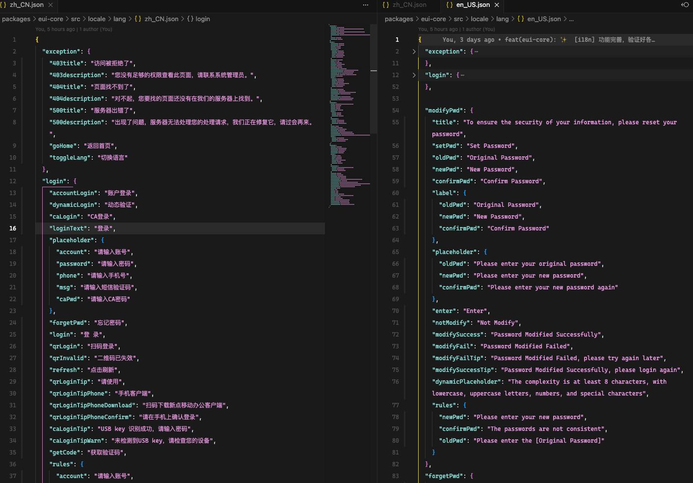
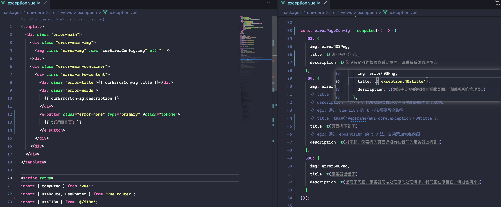
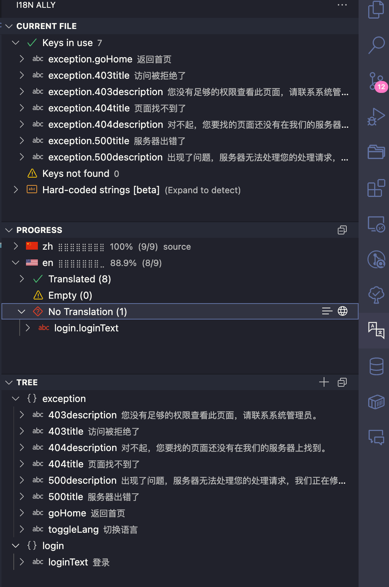
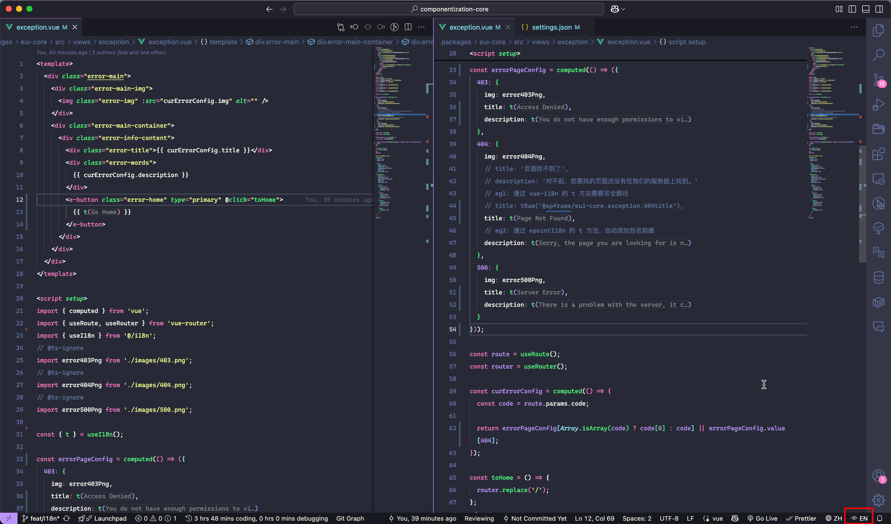
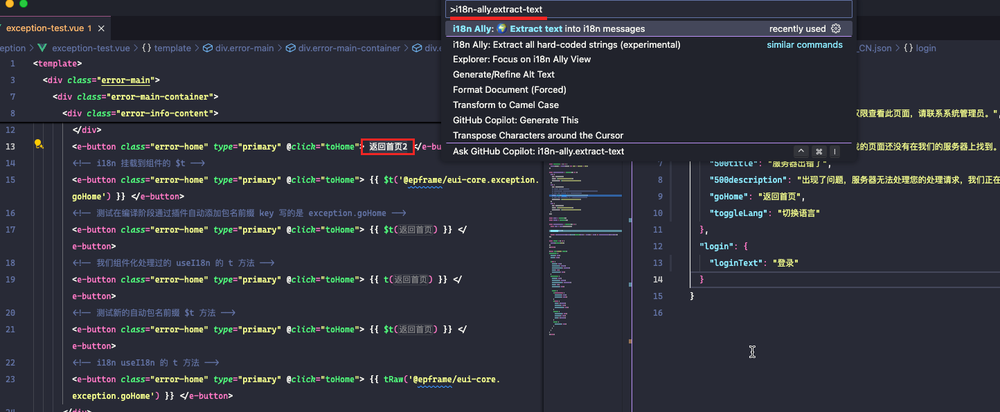
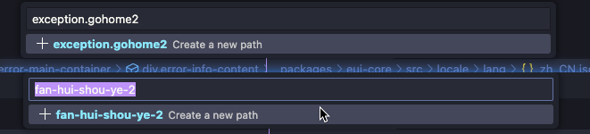
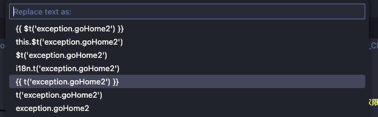
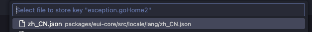
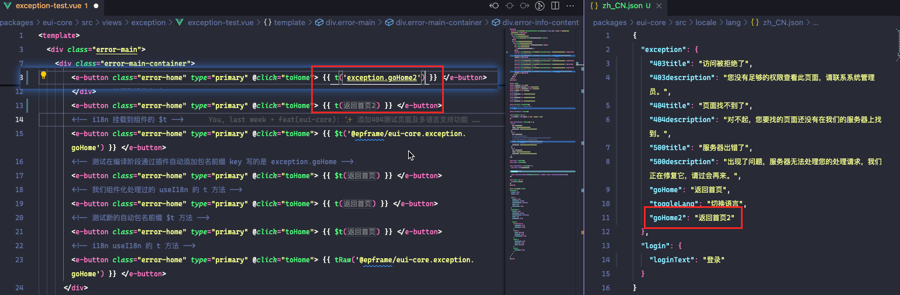

> 📖 **原文档地址**: [点击查看线上文档](http://192.168.219.170/docs/vue/latest/frame/guides/advanced/i18n/)

> 🚨 **注意**
>
> 这个特性正在进行架构上的重新调整，用法可能会出现变化。

多语言实现基于 vue-i18n 扩展，支持在我们的组件化体系下提供多语言能力。

## 使用方式

### 语言文件准备

在 `src/locale/lang` 目录下准备语言包文件， 约定文件名为 `zh_CN.json`、`en_US.json` 等，要接入多语言能力，必须实现新增语言包文件，至少存在 `zh_CN.json` 文件。

```jsonc
// src/locale/lang/zh_CN.json
{
  "message": {
    "hello": "你好，世界",
    "welcome": "欢迎使用我们的应用"
  },
  // 更多翻译内容... 自行添加，支持任意级别的嵌套展示
}
```

:::tip{title="注意"}

1. 语言文件内的层级虽然是任意的，但是我们推荐以页面或者功能模块进行组织，首层为页面或者功能模块，内部再按照实际内容按需组织。参考下方范例：

2. 虽然语言文件可以是 ts、js 或 yaml 格式，但推荐使用 JSON 格式，因为它更简单易读，且编辑器插件支持更好。（ts\js截止目前依旧无法使用提取），所以请请你不要随便修改格式

:::

<details>
<summary>语言文件示例</summary>



</details>

在 `src/locale/index.js` 中引入语言包文件，示例代码如下：

```js
import zhCN from './lang/zh_CN.json';
import enUS from './lang/en_US.json';
export { zhCN, enUS };
// 开发时准备好多少语言包文件就引入多少
```

### 页面中使用 t 翻译函数

在页面中使用时，可以通过 `useI18n` 钩子函数获取到语言 key 到实际翻译内容的映射函数，这个函数在模板区域和 js 区域中都可以使用。

首先从当前组件包/web工程中导入 `useI18n` 钩子函数, 进行调用，产出一个 `t` 函数用于获取翻译内容。

```js
import { useI18n } from '@/i18n';
const { t } = useI18n();
```

在模板区域中使用时，可以直接双花括号包裹并调用 `t` 使用来获取翻译内容。

```vue
<template>
  <div>
    <h1>{{ t('message.hello') }}</h1>
    <p>{{ t('message.welcome') }}</p>
  </div>
</template>
```

如果要当做属性值使用也是一样的

```vue
<template>
  <ep-input :placeholder="t('message.hello')" />
</template>
```

在 js 区域中使用时，可以直接调用 `t` 函数来获取翻译内容。

```js
const errorPageConfig = computed(() => ({
  403: {
    img: error403Png,
    title: t('exception.403title'),
    description: t('exception.403description')
  }
}));
```

一个完整写法如下(eui-core/src/views/exception/exception.vue)：

```vue
<template>
  <div class="error-main">
    <div class="error-main-img">
      
    </div>
    <div class="error-main-container">
      <div class="error-info-content">
        <div class="error-title">{{ curErrorConfig.title }}</div>
        <div class="error-words">
          {{ curErrorConfig.description }}
        </div>
        <e-button class="error-home" type="primary" @click="toHome">
          {{ t('exception.goHome') }}
        </e-button>
      </div>
    </div>
  </div>
</template>

<script setup>
import { computed } from 'vue';
import { useRoute, useRouter } from 'vue-router';
import { useI18n } from '@/i18n';
// @ts-ignore
import error403Png from './images/403.png';
// @ts-ignore
import error404Png from './images/404.png';
// @ts-ignore
import error500Png from './images/500.png';

const { t } = useI18n();

const errorPageConfig = computed(() => ({
  403: {
    img: error403Png,
    title: t('exception.403title'),
    description: t('exception.403description')
  },
  404: {
    img: error404Png,
    title: t('exception.404title'),
    description: t('exception.404description')
  },
  500: {
    img: error500Png,
    title: t('exception.500title'),
    description: t('exception.500description')
  }
}));

const route = useRoute();
const router = useRouter();

const curErrorConfig = computed(() => {
  const code = route.params.code;
  return errorPageConfig[Array.isArray(code) ? code[0] : code] || errorPageConfig.value[404];
});

const toHome = () => {};
</script>
```

:::tip{title="注意事项"}

`useI18n` 必须从 `@/i18n` 路径下引入，而不能是 `vue-i18n`，因为我们对其进行了封装和扩展，具体细节参考后文 [技术原理](#i18n-com-challenge) 部分。

`useI18n` 是一个 Vue 3 的组合式 API 钩子函数，它必须遵循 Vue 3 的组合式 API 使用规范，不能在组件的 `setup` 函数之外调用。

`useI18n` 钩子函数返回的 `t` 函数是响应式的，意味着如果语言切换了，页面会自动更新显示对应语言的内容,无需开发者手动干预处理。

:::

### 页面模板中使用 `$t` 翻译函数

引入 vue-i18n 后，它会自动在 Vue 实例上添加 `$t` 函数，这个函数可以无需引入直接在模板中使用。

```vue
<template>
  <div>
    <h1>{{ $t('message.hello') }}</h1>
    <p>{{ $t('message.welcome') }}</p>
  </div>
</template>
```

:::warning{title="注意事项"}
^(deprecated) 已废弃

~~我们不推荐使用 `$t` 函数，因为它是 vue-i18n 的原生函数，不像组件包自己的 `use18n` 钩子函数那样可以直接提供包名的作用域隔离功能。~~

~~虽然我们通过额外的编译插件解决了 `$t` 函数的作用域问题，但其需要使用额外的编译插件来处理，其发生在编译阶段，工程大、文件多时可能存在一定的性能损耗。~~

~~因此，推荐使用 `useI18n` 钩子函数来获取翻译内容，这样可以更好地控制作用域和性能。~~

~~具体细节参考后文 [技术原理](#i18n-com-challenge) 部分。~~

:::

### js 文件中使用工具方法 t 函数

在 js 文件中可以直接使用工具方法 `t` 来获取翻译内容。

```js
import { Utils } from '@epframe/eui-core';

const { t } = Utils;

const helloMessage =  t('message.hello');
const welcomeMessage = t('message.welcome');
```

## 编辑器插件

为了方便编辑器中编写多语言内容，并能直接看到实际文字，需要安装 [i18n Ally](https://marketplace.visualstudio.com/items?itemName=Lokalise.i18n-ally) 插件，并在 `settings.json` 中添加以下配置：

```json
{
  "i18n-ally.localesPaths": "**/src/locale/lang",
  "i18n-ally.keystyle": "nested",
  "i18n-ally.enabledParsers": ["ts", "js", "json", "json5"],
  "i18n-ally.enabledFrameworks": ["vue", "vue-sfc"],
  "i18n-ally.sourceLanguage": "zh_CN",
}
```

:::tip{title="注意事项"}

默认通过 `eui-cli` 工具创建的的工程会默认包含以上配置，如果是手动创建的工程或组件包，亦或者或历史创建的，需要手动添加。

当然如果你的插件未正常工作，也请检查是否有以上的配置项。正常来说以上配置存储在 `settings.json` 中， 在当前项目的 `.vscode` 目录下。

:::

### 引入编辑器插件后的展示效果

以上配置会让编辑器能知道我们的语言文件在什么目录下，并提供对应技术栈的支持，这样在编写多语言内容时，能够自动提示和补全语言 key，并能直接看到实际翻译内容，提升开发效率。

比如上面的 eui-core/src/views/exception/exception.vue 在编辑器中实际效果如下：



插件也有一个侧边栏，可以查看所有语言包的内容，以及语言包之间的差异（如哪个语言缺失了那个字段的翻译），方便管理和维护多语言内容。



插件右下角还可以切换到其他语言包，查看不同语言的翻译内容，方便对比和修改。



### 提取硬编码内容

如果在代码中有硬编码的字符串内容，插件会提供提取功能，可以将这些硬编码内容提取到语言包中，方便统一管理和维护。

具体操作步骤：

1. 安装插件后 会有一个 `i18n-ally.extract-text` 的命令，选中要提取的文本内容，执行这个命令, 如果你需要经常使用，可以为这个命令绑定自己的快捷键。
2. 会逐步询问你语言的 key 值、要提取到的文件、 当前提取后替换的字符串值，依次确认后将会在语言文件中生成对应的 key 值，并在代码中替换为翻译方法的调用。

以下是一个操作示例：

1. 选中文字，执行这个命令
  
2. 输入要提取的 key 值, 插件本身会自动生成一个 slug 值，但建议根据实际情况修改为更有意义的 key 值。
  
3. 选择要替换的模板写法，根据实际情况选择，通常选择 `\{\{ t('key') \}\}`（模板中） 或 t('key')（脚本中）。
  
4. 选择要提取到的语言文件，通常是 `zh_CN.json` 或其他语言文件。
  
5. 确认提取后，插件会在语言文件中生成对应的 key 值，并在代码中替换为翻译方法的调用。
  

## 迁移指南 \{#migration}

如果是通过 `eui-cli` 工具在 [2025-06-16] 后创建的组件和项目，无需处理，直接按照使用方式进行使用即可，针对历史已经初始化的组件和 web 工程，参阅下面说明：

无论是组件包还是 web 工程都涉及以下文件的新增或改动

```bash
├─vite.config.js           # 修改新增插件
└─src
   ├─ i18n                 # 新增 i18n 目录
   ├    └─ index.js        # 新增文件(固定内容)
   ├─ locale               # 新增语言文件目录
   ├    ├  lang            # 新增语言文件目录
   ├    ├    └─ zh_CN.json # 新增语言包文件，内容自行添加
   ├    └─ index.js        # 新增文件(固定内容)
   ├─ index.js             # 修改新增内容 (固定内容) web 工程不需要
   └─ setup.js             # 修改新增内容 (固定内容)
```

PS:  如果工程使用 ts 则上面部分文件的的扩展名是 ts 即可，内容相同。

需要更新或新增以下 3 个组件：

- ^(deprecated) 已废弃 ~~`@epframe/vite-plugin-i18n-auto-prefix`：[新增] 用于处理模板中的 `$t` 函数自动添加包名前缀。 `pnpm add -D @epframe/vite-plugin-i18n-auto-prefix`~~
- `@epframe/vite-plugin-workspace-hmr`：[更新] 用于处理开发阶段多包直接指向源码，需要确保版本大于 `0.0.8`。
- `@epframe/eui-core`：[更新]组件化基础包，提供了相关基础能力，需要确保版本大于 `1.0.31`。

### 组件包

上面描述的目录和文件在组件包目录下创建好。

#### src/i18n/index.js

此文件内固定，拷贝下面内容到文件中：

`src/i18n/index.js`

```js
import { name as packageName } from '../../package.json';
import { createScopedUseI18n } from '@epframe/eui-core';

/**
 * 提供 组件化级别的 i18n
 * 作用: 自动添加包名前缀 useI18n 返回的 t 方法中： t('exception.404title') => t('当前包名.exception.404title')
 */
export const useI18n = createScopedUseI18n(packageName);
```

#### src/locale/lang/zh_CN.json

此文件就是编写语言翻译的文件，初始内容写法如下，拷贝下面内容到文件中即可：

`src/locale/lang/zh_CN.json`

```jsonc
{
  // 开始编写你的语言包内容，支持任意级别的嵌套展示,eg:
    /*
    "exception":{"404title":"404 - 页面未找到","404description":"抱歉，您访问的页面不存在。","goHome":"返回首页"},
    "login":{"form":{"username":"用户名","password":"密码","remember":"记住我","submit":"登录","reset":"重置"},"btn":"login"},
    "message":{"hello":"你好，世界","welcome":"欢迎使用我们的应用"}
    */
};
```

#### src/locale/index.js

此文件是聚合所有语言包文件的入口文件，首次创建只有 `zh_CN.json` 文件，因此固定拷贝一下内容即可：

`src/locale/index.js`

```js
import zhCN from './lang/zh_CN.json';
export { zhCN };
```

#### src/index.js

此文件是组件包的打包入口文件，需要新增以下固定内容：

`src/index.js`

```js
export * as Locale from './locale';
```

#### src/setup.js

此文件是组件包的初始化安装方法，修改新增以下固定内容，为看到整体效果，以下为完整内容，修改看高亮的行即可。

`src/setup.js`

```js meta="{3,6-7,19}"

/**
 * 初始化框架提供的能力
 */

  initRouter();
  Routers.registerRouterMap(routerMap);

  // -- 修改开始部分

  // 注册添加当前组件的语言包
  epointI18n.registerComponent(packageName, 'zh_CN', zhCN); // 新增此行

  // --- 修改结束部分

  globalComponents.forEach((com) => {
    if (com.name) {
      app.component(com.name, com);
    } else {
      console.error('全局注册组件出错，必须提供name属性', com);
    }
  });

  // 注册全局指令
  globalDirectives.forEach((it) => {
    app.directive(it.name, it.directive);
  });
};

```
<details>
<summary>已废弃</summary>

#### vite.config.js

这个是 Vite 的配置文件，需要新增一个编译插件来处理直接使用 $t 的自动前缀转换，新增插件，调用插件即可，具体改动如下：

`vite.config.js`

```js meta="{1,5-6}"

  plugins: [
    vue(),
    // 添加 i18n 转换插件，自动为模板中的 $t 调用添加包名前缀
    createI18nTransformPlugin(packageName),
    routeInfoBuild()
  ],
  // ... 其他配置
});
```

</details>

### web 工程

上面描述的目录和文件在 web 工程目录下创建好。

- `src/i18n/index.js` ：修改方法和组件包一致。
- `src/locale/lang/zh_CN.json`  ：修改方法和组件包一致。
- `src/locale/index.js` ：修改方法和组件包一致。
- `src/index.js`： web 工程不存在此文件，不需要修改。
- `vite.config.js`：修改方法和组件包一致，如果引入了 `workspaceHMR` 插件，必须在 `workspaceHMR` 之后添加 `createI18nTransformPlugin` 插件。
- `src/setup.js`：修改内容和组件包略有不同，参考下面代码：

```js

// ... 现有代码

  // 新增下面代码， 用于在切换语言时自动加载组件库的语言包
  if (!options) {
    options = {
      epI18n: {
        // i18n: null,
        // 组件库的语言模块， 传入此配置项可以实现在切换语言时无需手动干预自动加载组件库的语言包
        euiComponentLocaleModules: import.meta.glob('/node_modules/@epoint-fe/eui-components/dist/locale/*.min.mjs'),
      }
    };
  }
  epointI18n.registerComponent(packageName, 'zh_CN', zhCN); // 新增此行 推荐在 setup 方法中最前面
  // ... 现有代码
};

```

## 技术原理

本项目使用了 `vue-i18n` 作为多语言支持的基础库，并在此基础上结合我们的组件化机制进行了封装和扩展，提供了更好的使用体验优化。

其核心的原理是将语言文件在开发阶段提取出来，在使用的时候通过一个函数去获取对应的翻译内容，这个函数会根据当前的语言环境自动切换。

如整个系统中会有下面的语言包文件：

```json
{
  "zh_CN": {
    "message": {
      "hello": "你好，世界",
      "welcome": "欢迎使用我们的应用"
    }
  },
  "en_US": {
    "message": {
      "hello": "Hello, World",
      "welcome": "Welcome to our application"
    }
  }
}
```

页面使用时会通过一个翻译函数 `t` 来获取对应的翻译内容，如 `t('message.hello')` 会根据当前语言环境返回 "你好，世界" 或 "Hello, World"。

<details>
<summary>已废弃，语言key值不再添加组件包前缀</summary>

## 我们组件化下的挑战和处理方案 \{#i18n-com-challenge}

### 问题背景

在我们的组件化中，不同功能在不同的包里内，在这种多包架构中：

- 组件化开发模式下，单个组件包内，语言文件中的 key 值定义为了减少层级，直接是当前包内的 key 值。
  - 一是为了方便开发者编写和维护，无需在意中添加过多的层级。
  - 二是只有这样编辑器内的插件才有有效的识别和展示(因为组件包代码独立，而插件依赖源码来进行提示和展示)。
- vue-i18n 的翻译方法需要传入的 key 值和语言包中的 key 值一致，也就是说在 `@epframe/eui-core` 组件中，必须使用 `$t('@epframe/eui-core.exception.403title')` 或 `t('@epframe/eui-core.exception.403title')` 来获取翻译内容。
- vue-i18n 全局只有一个 `$t` 方法

比如 组件包 `@epframe/eui-core` 中，语言文件中的 key 值定义如下：

```json
{
  "exception": {
    "403title": "访问被拒绝了",
    "403description": "您没有足够的权限查看此页面，请联系系统管理员。",
    "404title": "页面找不到了",
    "404description": "对不起，您要找的页面还没有在我们的服务器上找到。",
    "500title": "服务器出错了",
    "500description": "出现了问题，服务器无法处理您的处理请求，我们正在修复它，请过会再来。",
    "goHome": "返回首页",
    "toggleLang": "切换语言"
  },
  "login": {
    "loginText": "登录"
  }
}

```

但整个系统中，一个 web 工程中存在多个组件包，最终汇聚使用的语言包格式如下：

```js
const demo: Record<string, EpLocalePackageMessages> = {
  "zh_CN": {
    // 组件1
    "@epframe/eui-core": {
      exception: {
        "403title": "访问被拒绝了",
        "403description": "您没有足够的权限查看此页面，请联系系统管理员。",
        "404title": "页面找不到了",
        "404description": "对不起，您要找的页面还没有在我们的服务器上找到。",
        "500title": "服务器出错了",
        "500description":
          "出现了问题，服务器无法处理您的处理请求，我们正在修复它，请过会再来。",
      },
      login: {
        loginText: "登录",
      },
    },
    // 组件2
    "@epframe/epoint-mini": {
      etasklist: {
        title: "任务列表",
        clientGuid: "业务主键",
        clientTag: "业务类型",
        clientName: "业务名称",
        groupId: "分组标识",
      },
    },
  },
  "en_US": {},
};
```

但页面中使用时， 我们希望直接写 `'exception.403title'` ，而不是 `'@epframe/eui-core.exception.403title'` 。

```html
<template>
  <div>
    <!-- 我们希望是 -->
    <h1>{{ $t('exception.403title') }}</h1>
    <p>{{ t('exception.403description') }}</p>
    <!-- 而不是 -->
    <!-- <h1>{{ $t('@epframe/eui-core.exception.403title') }}</h1> -->
    <!-- <p>{{ t('@epframe/eui-core.exception.403description') }}</p> -->
  </div>
</template>
```

因为这样：

1. 针对开发者来说，可以专注于当前业务，不需要关心包名前缀。
2. 只有不带前缀的 key 值，vscode 等编辑器才能正确智能提示以及把 key 值在开发阶段显示成这中文。

所以我们需要解决自动补全前缀的问题，这里分 2 个场景：

1. `useI18n` 钩子产生的 `t` 翻译函数： 这个我们通过每个组件自己提供一个 `useI18n` 方法，自动加上自己的前缀。
2. `vue-i18n` 全局挂载的 `$t` 函数： 由于 `$t` 挂在到 `app.config.globalProperties` 上，全局只有一个，无法按照组件区分，所以我们通过插件在编辑阶段替换处理。

### 组件包自己的 `useI18n` 钩子函数

我们在每个组件包中提供一个 `useI18n` 钩子函数，这个函数会自动添加当前组件包的前缀。

每个组件包中均在 `src/i18n/index.js` 中提供一个 `useI18n` 钩子函数，代码如下：

```js

/**
 * 提供 组件化级别的 i18n
 * 作用: 自动添加包名前缀 useI18n 返回的 t 方法中： t('exception.404title') => (vue-i18n的 t 方法)('当前包名.exception.404title')
 */

```

这样每个组件自己使用自己的 `useI18n` 钩子函数时，都会先经过组件包自己的处理，自动添加上包名前缀。在页面中使用时，就可以直接写 `t('exception.403title')`，而不需要关心包名前缀。

### vue-i18n 全局 `$t` 函数的处理

由于 vue-i18n 的 `$t` 函数是全局的，仅在 web 工程实际创建的 app 实例上挂载，我们无法区分不同组件包，因此我们通过自己实现的编译插件 - [i18n 模板转换插件](http://192.168.217.8/febase/vue/vite-plugins/vite-plugin-i18n-auto-prefix) 来处理。

#### 首先进行安装

```bash
pnpm add -D @epframe/vite-plugin-i18n-auto-prefix
```

#### 在 Vite 配置中添加插件

```js
// vite.config.js

  plugins: [
    vue(),
    // 添加 i18n 转换插件
    createI18nTransformPlugin("@scope/your-package-name", {
      debug: true, // 是否开启调试模式， 默认是 process.env.NODE_ENV === 'development'
      include: /\.vue$/, // 需要处理的文件扩展名， 默认是 /\.vue$/
      exclude: undefined, // 排除的文件， 默认是 undefined
      // path2name: (path) => {},  // 一个方法，支持自定义路径到包名的转换逻辑
    }),
  ],
});
```

#### 在模板中正常使用 $t

```vue
<template>
  <div>
    <!-- 会被自动转换为 $t('@scope/your-package-name.exception.404title') -->
    <h1>{{ $t("exception.404title") }}</h1>

    <!-- 会被自动转换为 $t('@scope/your-package-name.exception.404description') -->
    <p>{{ $t("exception.404description") }}</p>

    <!-- 已有完整路径，不会被转换 -->
    <span>{{ $t("@epframe/other-package.some.key") }}</span>
  </div>
</template>
```

#### 支持的格式

```
$t('key')    → $t('@package/name.key')
$t("key")    → $t("@package/name.key")
$t(`key`)    → $t(`@package/name.key`)
$t( 'key' )` → $t( '@package/name.key' )
```

#### 不转换的情况

- 已有 `@` 前缀：`$t('@other/package.key')` 保持不变
- 动态 key：`$t(dynamicKey)` 保持不变
- 表达式：`$t('prefix.' + suffix)` 保持不变

</details>