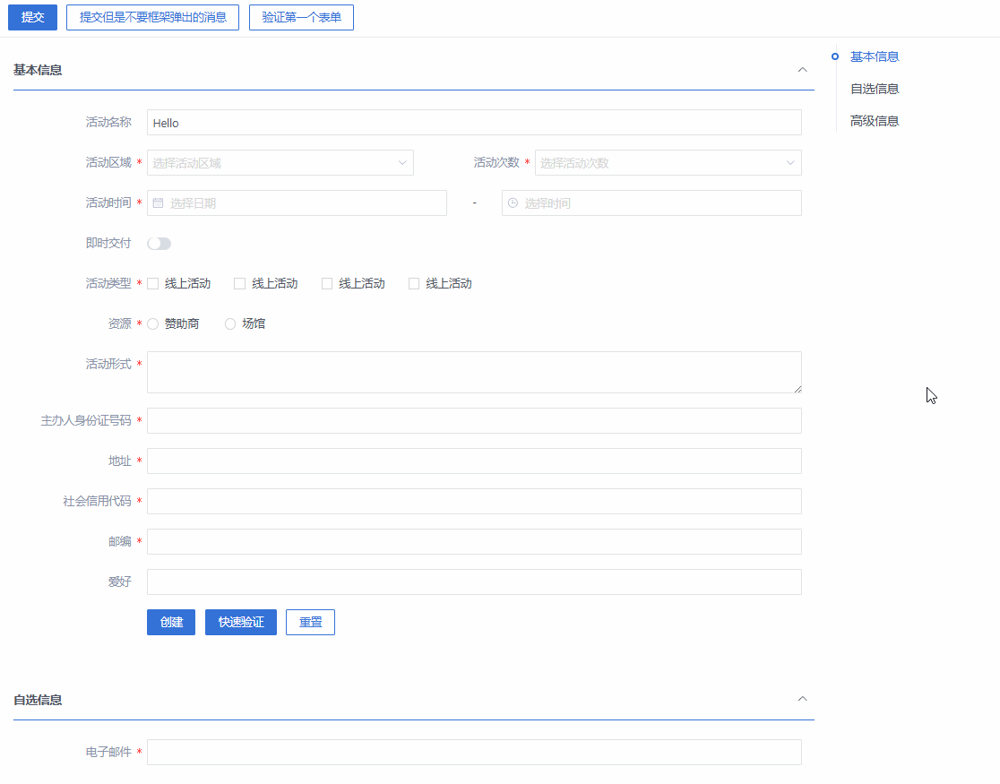

> 📖 **原文档地址**: [点击查看线上文档](http://192.168.219.170/docs/vue/latest/frame/guides/advanced/validation/)

此方法的设计初衷在于能在页面上通过一个方法，快速实现对当前页面中所有的表单进行验证，并自动组装并提示类似 F9 的错误提示。

组件库的的验证实现在表单上，我们需要通过 `EForm` 实例的 `validate` 方法来触发验证，验证失败弹出的错误提示需要自己实现。
如果有多个表单，代码中还需要逐个调用验证方法，组织比较烦琐，因此提供此方法。

## 使用方法

```js
import { Hooks } from '@epframe/eui-core';

const { validate } = Hooks.useValidation();

// 在需要验证的地方调用
const save = async () => {
  if (await validate()) {
    // 验证通过，执行保存操作 框架提示已经默认集成
  }
};
```

## Api 说明 \{#api}

`validate` 方法的说明如下：

- 参数：`formRef` 参数，值是一个表单的引用，如果不传，则默认验证当前页面中所有的表单。
- 参数：`callback` 参数，自定义的验证处理函数，类型参考 `ValidateCallback` 显式返回 `false` 则不弹出框架的提示
- 返回值：`Promise<boolean>`，验证通过返回 `true`，验证失败返回 `false`。

```ts
/**
 * 表单验证方法
 *
 * @param {Ref | undefined} [formRef]        = 要验证的表单，不传时验证当前组件下的全部e-form
 * @param {ValidateCallback} [callback=noop] = 自定义的验证处理函数，参考 ValidateCallback 显式返回 false 则不弹出框架的提示
 * @return {boolean}  {Promise<boolean>}     = 以Promise的形式返回是否验证通过， 如果需要具体的错误信息，请使用第二个参数
 */
async function validate(formRef?: Ref, callback: ValidateCallback = noop): Promise<boolean>;
```

`ValidateCallback` 类型如下：

```ts
/**
 * 验证的处理函数
 * @param {boolean} vaild                                = 是否验证通过
 * @param {string | undefined} firstError                = 第一个验证失败的错误消息, 验证成功下不存在
 * @param {Array<ValidateFieldsError>| undefined} errors = 全部验证失败的表单字段，值是一个数组，成员为表单内的验证失败字段， 验证成功下不存在
 */
type ValidateCallback = (valid: boolean, firstError?: string, errors?: Array<ValidateFieldsError>) => void | boolean;
```

`ValidateFieldsError` 为 `EForm` 的 `validate` 方法返回的错误对象，如下：

```ts
type ValidateFieldsError = Record<string, ValidateError[]>;

interface ValidateError {
  message?: string;
  value?: Value;
  field?: string;
  name?: string;
}
```

## 使用实例

导入此方法后，在提交表单时，调用此方法即可实现对当前页面中所有的表单进行验证。

### 核心代码

模板部分

```html
<e-button @click="save" type="primary">提交</e-button>
<e-button @click="save2">提交但是不要框架弹出的消息</e-button>
<e-button @click="save3">验证第一个表单</e-button>
```

js 部分

```js
const loading = ref(false);

const { validate } = useValidation();
const save = async () => {
  loading.value = true;
  const isValid = await validate();
  logger.info(isValid);

  if (isValid) {
    // 验证通过 做提交
  } else {
    // 验证失败
  }
  loading.value = false;
};

const save2 = async () => {
  loading.value = true;
  const isValid = await validate(null, (isValid, firtError, errors) => {
    logger.info('这是验证的回调函数，三个参数分别是【是否验证通过】， 【第一个错误信息】 【全部的错误】');
    logger.info(isValid, firtError, errors);

    // 比如换成alert弹出
    EMessageBox.alert(firtError || '表单验证失败', '验证失败', {
      type: 'error',
      callback: (action) => {
        logger.info('用户点击了', action);
      }
    });
    // 再比如把验证信息全部集中显示
    EMessageBox.alert(
      errors
        .map((form) => {
          return Object.keys(form)
            .map((field) => `<div>${field}:${form[field].map((error) => error.message).join('；')}<div>`)
            .join('');
        })
        .join(''),
      '以下字段未验证通过',
      {
        dangerouslyUseHTMLString: true,
        type: 'error'
      }
    );

    // 此方法返回false 可以阻止框架的自动弹出验证失败的提示
    return false;
  });
  logger.info(isValid);

  loading.value = false;
};

const save3 = async () => {
  loading.value = true;
  const isValid = await validate(formRef1);
  logger.info(isValid);
  if (isValid) {
    // 验证通过 做提交
  } else {
    // 验证失败
  }
  loading.value = false;
};
```

### 效果



### 完整代码

<details>
<summary>点击查看完整代码</summary>

```vue
<template>
  <e-container class="fui-page">
    <e-main>
      <e-toolbar>
        <e-button @click="save" type="primary">提交</e-button>
        <e-button @click="save2">提交但是不要框架弹出的消息</e-button>
        <e-button @click="save3">验证第一个表单</e-button>
      </e-toolbar>
      <e-content>
        <e-collapse show-nav v-model="openedNav">
          <e-collapse-item name="form1" title="基本信息">
            <e-form
              ref="formRef1"
              :model="ruleForm"
              :rules="rules"
              :label-width="labelWidth"
              class="demo-ruleForm"
              status-icon
            >
              <e-form-item label="活动名称" prop="name">
                <e-input v-model="ruleForm.name" />
              </e-form-item>
              <e-row>
                <e-col :span="12">
                  <e-form-item label="活动区域" prop="region">
                    <e-select v-model="ruleForm.region" placeholder="选择活动区域" style="width: 100%">
                      <e-option label="区域一" value="shanghai" />
                      <e-option label="区域二" value="beijing" />
                    </e-select>
                  </e-form-item>
                </e-col>
                <e-col :span="12">
                  <e-form-item label="活动次数" prop="count">
                    <e-select
                      v-model="ruleForm.count"
                      placeholder="选择活动次数"
                      :options="options"
                      :virtual-list-props="{
                        height: 200
                      }"
                      style="width: 100%"
                    />
                  </e-form-item>
                </e-col>
              </e-row>

              <e-form-item label="活动时间" required>
                <e-col :span="11">
                  <e-form-item prop="date1">
                    <e-date-picker
                      v-model="ruleForm.date1"
                      type="date"
                      label="选择日期"
                      placeholder="选择日期"
                      style="width: 100%"
                    />
                  </e-form-item>
                </e-col>
                <e-col class="text-center" :span="2">
                  <span class="text-gray-500">-</span>
                </e-col>
                <e-col :span="11">
                  <e-form-item prop="date2">
                    <e-time-picker
                      v-model="ruleForm.date2"
                      label="选择时间"
                      placeholder="选择时间"
                      style="width: 100%"
                    />
                  </e-form-item>
                </e-col>
              </e-form-item>
              <e-form-item label="即时交付" prop="delivery">
                <e-switch v-model="ruleForm.delivery" />
              </e-form-item>
              <e-form-item label="活动类型" prop="type">
                <e-checkbox-group v-model="ruleForm.type">
                  <e-checkbox value="线上活动" label="线上活动" name="type" />
                  <e-checkbox value="促销活动" label="线上活动" name="type" />
                  <e-checkbox value="线下活动" label="线上活动" name="type" />
                  <e-checkbox value="简单品牌曝光" label="线上活动" name="type" />
                </e-checkbox-group>
              </e-form-item>
              <e-form-item label="资源" prop="resource">
                <e-radio-group v-model="ruleForm.resource">
                  <e-radio value="赞助商" label="赞助商" />
                  <e-radio value="场馆" label="场馆" />
                </e-radio-group>
              </e-form-item>
              <e-form-item label="活动形式" prop="desc">
                <e-input v-model="ruleForm.desc" type="textarea" />
              </e-form-item>
              <e-form-item label="主办人身份证号码" prop="idCard">
                <e-input v-model="ruleForm.idCard" />
              </e-form-item>
              <e-form-item label="地址" prop="address">
                <e-input v-model="ruleForm.address" />
              </e-form-item>
              <e-form-item label="社会信用代码" prop="creditCode">
                <e-input v-model="ruleForm.creditCode" />
              </e-form-item>
              <e-form-item label="邮编" prop="postCode">
                <e-input v-model="ruleForm.postCode" />
              </e-form-item>
              <e-form-item label="爱好" prop="hobby">
                <e-input v-model="ruleForm.hobby" />
              </e-form-item>
              <e-form-item>
                <e-button type="primary" @click="submitForm(ruleFormRef)"> 创建 </e-button
                ><e-button type="primary" @click="quicklyValidate(ruleFormRef)"> 快速验证 </e-button>
                <e-button @click="resetForm(ruleFormRef)">重置</e-button>
              </e-form-item>
            </e-form>
          </e-collapse-item>
          <e-collapse-item name="form2" title="自选信息">
            <e-form ref="formRef2" :model="dynamicValidateForm" :label-width="labelWidth">
              <e-form-item
                prop="email"
                label="电子邮件"
                :rules="[
                  { type: 'email', required: true, message: '请输入正确的电子邮件地址', trigger: ['blur', 'change'] }
                ]"
              >
                <e-input v-model="dynamicValidateForm.email" />
              </e-form-item>
            </e-form>
          </e-collapse-item>
          <e-collapse-item name="form3" title="高级信息">
            <e-form ref="formRef3" :model="dynamicValidateForm2" :label-width="labelWidth">
              <e-form-item
                prop="email"
                label="电子邮件"
                :rules="[
                  { type: 'email', required: true, message: '请输入正确的电子邮件地址', trigger: ['blur', 'change'] }
                ]"
              >
                <e-input v-model="dynamicValidateForm2.email" />
              </e-form-item>
            </e-form>
          </e-collapse-item>
        </e-collapse>
      </e-content>
    </e-main>
  </e-container>
</template>

<script setup>
import { onMounted, reactive, ref } from 'vue';
import { Hooks } from '@epframe/eui-core';
import { EContent, EToolbar } from '@frame/layouts';
import { EMessageBox } from '@epoint-fe/eui-components';

const openedNav = ref(['form1', 'form2', 'form3']);

const labelWidth = '150px';

const formRef1 = ref(); // 表单引用
const ruleForm = reactive({
  name: 'Hello', // 活动名称
  region: '', // 活动区域
  count: '', // 活动次数
  date1: '', // 活动日期
  date2: '', // 活动时间
  delivery: false, // 即时交付
  type: [], // 活动类型
  resource: '', // 资源
  desc: '', // 活动形式
  idCard: '', // 主办人身份证号码
  url: 'abc',
  email: '',
  num: 0,
  address: '',
  creditCode: '',
  postCode: '',
  hobby: ''
});

const rules = reactive({
  name: [
    {
      // type: 'string',
      validator: (v, opt) => {
        if (v.length >= 3 && v.length <= 5) {
          return true;
        }
        return new Error('长度应为3至5个字符');
      },
      required: false,
      min: 3,
      max: 5,
      // message: '长度应为3至5个字符',
      trigger: 'blur'
    }
  ],
  region: [{ required: true, message: '请选择活动区域', trigger: 'change' }],
  count: [{ required: true, trigger: 'change' }],
  date1: [{ required: true, type: 'date', message: '请选择日期', trigger: 'change' }],
  date2: [{ required: true, type: 'date', message: '请选择时间', trigger: 'change' }],
  type: [{ required: true, message: '请至少选择一个活动类型', trigger: 'change' }],
  resource: [{ required: true, message: '请选择活动资源', trigger: 'change' }],
  desc: [{ required: true, message: '请输入活动形式', trigger: 'blur' }],
  idCard: [{ type: 'idCard', required: true, message: '必须是身份证格式', trigger: 'blur' }],
  url: [{ type: 'url', required: true, trigger: 'blur' }],
  email: [{ type: 'email', required: true, trigger: 'blur' }],
  num: [{ type: 'number', min: 3, max: 10, message: '人数应在3-10人之间', trigger: ['blur', 'change'] }],
  address: [{ type: 'string', required: true, min: 10, trigger: 'blur' }],
  creditCode: [{ type: 'creditCode', required: true, min: 10, trigger: 'blur' }],
  postCode: [{ type: 'postCode', required: true, min: 10, trigger: 'blur' }],
  hobby: [{ type: 'enum', enums: ['读书', '音乐', '写代码'], trigger: 'blur' }]
});

const submitForm = async (formEl) => {
  if (!formEl) return;
  await formEl.validate((valid, fields) => {
    if (valid) {
      logger.info('提交成功！');
    } else {
      logger.info('提交失败！', fields);
    }
  });
};
const quicklyValidate = async (formEl) => {
  if (!formEl) return;
  await formEl.fastValidate((valid, fields) => {
    if (valid) {
      logger.info('验证成功！');
    } else {
      logger.info('验证失败！', fields);
    }
  });
};
const resetForm = (formEl) => {
  if (!formEl) return;
  formEl.resetFields();
};

const options = Array.from({ length: 10000 }).map((_, idx) => ({
  value: `${idx + 1}`,
  label: `${idx + 1}`
}));

const formRef2 = ref();

const dynamicValidateForm = ref({
  email: ''
});
const formRef3 = ref();

const dynamicValidateForm2 = ref({
  email: ''
});

const loading = ref(false);

const { validate } = Hooks.useValidation();
const save = async () => {
  loading.value = true;
  const isValid = await validate();
  logger.info(isValid);

  if (isValid) {
    // 验证通过 做提交
  } else {
    // 验证失败
  }
  loading.value = false;
};

const save2 = async () => {
  loading.value = true;
  const isValid = await validate(null, (isValid, firtError, errors) => {
    logger.info('这是验证的回调函数，三个参数分别是【是否验证通过】， 【第一个错误信息】 【全部的错误】');
    logger.info(isValid, firtError, errors);

    // 比如换成alert弹出
    EMessageBox.alert(firtError || '表单验证失败', '验证失败', {
      type: 'error',
      callback: (action) => {
        logger.info('用户点击了', action);
      }
    });
    // 再比如把验证信息全部集中显示
    EMessageBox.alert(
      errors
        .map((form) => {
          return Object.keys(form)
            .map((field) => `<div>${field}:${form[field].map((error) => error.message).join('；')}<div>`)
            .join('');
        })
        .join(''),
      '以下字段未验证通过',
      {
        dangerouslyUseHTMLString: true,
        type: 'error'
      }
    );

    // 此方法返回false 可以阻止框架的自动弹出验证失败的提示
    return false;
  });
  logger.info(isValid);

  loading.value = false;
};

const save3 = async () => {
  loading.value = true;
  const isValid = await validate(formRef1);
  logger.info(isValid);
  if (isValid) {
    // 验证通过 做提交
  } else {
    // 验证失败
  }
  loading.value = false;
};

// onMounted(async () => {
//   const x = await validate();
//   logger.info(x);
// });
</script>
```

</details>