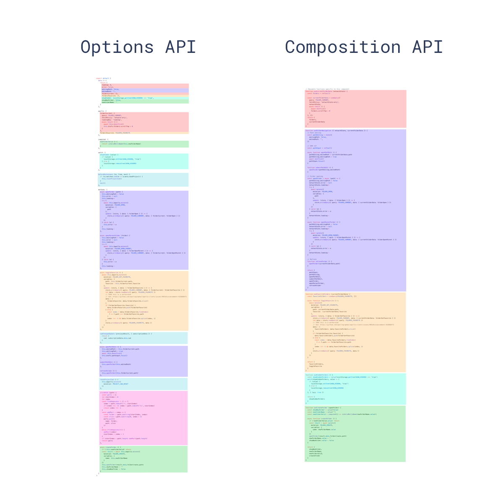

> 📖 **原文档地址**: [点击查看线上文档](http://192.168.219.170/docs/vue/latest/frame/guides/base/coding-standards/)

> **💡 提示**
>
> 请所有开发者认真阅读并严格遵守本规范，以确保项目的代码质量和可维护性。

## 目录组织规范

### 整体结构

整个工程结构如下：

```sh
├─dist                  # 打包后的目录
├─public                # 公共静态资源目录
└─src
  ├─api                 # 接口文件（仅限全局公用，否则请在页面目录内内聚）
  ├─assets              # 资源文件（仅限全局公用，否则请在页面目录内内聚）
  ├─components          # 组件文件（仅限全局公用，否则请在页面目录内内聚）
  ├─locale              # 语言
  ├─router              # 路由
  ├─store               # 状态管理
  ├─style               # 样式文件
  ├─theme               # 主题配置（组件工程不需要此目录）
  ├─views               # 页面管理
  │ └─frame-ou          # 部门管理目录（示例，可按需创建）
  │   ├─edit.js         # 部门管理弹窗编辑页面数据模型定义（约定与页面名一致）
  │   ├─edit.vue        # 部门管理弹窗编辑等子模块（命名和功能看具体子模块所需，可多个）
  │   ├─list.js         # 部门管理弹列表页面数据模型定义（约定与页面名一致）
  │   └─list.vue        # 部门管理列表页面
  └─utils               # 通用工具方法
```

> **⚠️ 警告**
>
> 需要注意的是，src目录下的 `api` 和 `assets` 和 `components` 等 目录仅限全局公用，如果你相关的资源不是全局的，请务必在页面自己的目录内内聚。
> 
> 我们始终推崇就近原则，页面相关的资源应该放在页面自己的目录内，而不是放在全局目录下。
> 
> 好处，拷贝页面使用的时候，基本上目录拷走就可以了，不需要再去拷贝全局目录下的资源，也不需要在拷贝完成后还需要修改资源的引入路径。

### 命名规范

- **文件名称**： 目录和文件名称全部采用 ****`kebab-case` 命名规范，即小写英文加短横线连接，例如：`frame-user`。
- **组件标签**： `.vue` 文件中所有的组件标签也全部采用 `kebab-case` 命名规范，即小写英文加短横线连接，例如：`<ep-form>  </ep-form>`, 如果标签内不需要内容，是单标签，推荐直接闭合，如： `<ep-input />`。
- **组件属性**： 组件的属性名称也全部采用 `kebab-case` 命名规范，即小写英文加短横线连接，例如：`<e-form-item label-width="120px">`。
- **组件名称**： 组件名称的定义和导出，全部使用 `PascalCase` 命名规范，即首字母大写，例如：`EpForm`。这样导入的组件，页面中默认可自动识别, 在标签区域可以直接以 `<ep-form>` 使用。
- **组件属性定义**： Props 的定义，统一使用小驼峰命名规范，即首字母小写，例如：`defineProps(['errorMessage', 'stateIcon'])`， 页面模板中自动识别使用 `kebab-case` 命名规范。

:::hl{title="总结" color="green"}

- 文件名称： `kebab-case`
- 模板中： 标签和属性： `kebab-case`
- 组件名称： `PascalCase`
- 大部分变量： 小驼峰命名规范，即首字母小写，例如：`pageName`，`statusCode`， 少部分常量可以使用全部大写。

:::

### 页面目录

所有的页面都应该放在 `src/views` 目录中。但是请务必不要把所有页面全部都扁平全部直接放在 `src/views` 目录下，而是根据业务模块来组织目录结构。

一个页面自己的资源（包含页面、图片等所有静态资源）都统一放在以当前页面的文件夹内。

所有文件名（含目录）请务必遵守[命名规范](#命名规范)，即统一使用小写英文加短横线连接。

views 下的目录不要求扁平结构，因此你可以根据业务需求来组织目录结构，但最终的一层的目录内的文件名称建议遵循以下约定：

- 仅供此模块使用的公共组件放在当前目录的 `components` 目录下
- 仅供给此模块使用的静态资源，如图片、字体文件等，放在当前目录的 `assets` 目录下，如果只有图片，也可以直接用 `images` 目录。
- 约定列表页面名字固定为 `list.vue`；
- 约定表单编辑页面名字固定为 `edit.vue`；
- 约定表单新增页面名字固定为 `add.vue`；
- 约定表单详情页面名字固定为 `detail.vue`；
- 约定**标准编码模型 js 文件名和页面名一致**，所有业务接口请求和页面控件上数据变量都在该文件中定义；
- 其他相关的子模块页面命名根据功能业务进行命名，命名规则与模块命名规则一致，即采用小写英文加破折号连接。

以开发一个通讯录模块为例，预期的目录结构如下：

```sh
├─src
  └─views
   └─ ...这里省略N层
     └─address-book         # 通讯录模块
       ├─images             # 图片资源
       │  ├─icon1.png
       │  ├─icon2.png
       │  └─icon3.png
       ├─components         # 此模块使用的公共组件
       │  ├─user-card.vue
       │  └─user-panel.vue
       ├─list.vue           # 列表页面
       ├─list.js            # 列表页标准编码模型 js 文件
       ├─edit.vue           # 编辑页面
       └─edit.js            # 编辑页标准编码模型 js 文件
```

## Vue API 风格规范

[Vue - API 风格](https://cn.vuejs.org/guide/introduction.html#api-styles) Vue 的编写可以按两种不同的风格书写：~~**选项式 API**~~ 和**组合式 API**。 我们要求统一使用**组合式 API**风格。

<details>
<summary>为什么要求使用组合式 API</summary>

以下是Vue官方文档中讲解两种风格时的代码对比：

**选项式**

```vue
<script>
export default {
  // data() 返回的属性将会成为响应式的状态
  // 并且暴露在 `this` 上
  data() {
    return {
      count: 0
    };
  },

  // methods 是一些用来更改状态与触发更新的函数
  // 它们可以在模板中作为事件处理器绑定
  methods: {
    increment() {
      this.count++;
    }
  },

  // 生命周期钩子会在组件生命周期的各个不同阶段被调用
  // 例如这个函数就会在组件挂载完成后被调用
  mounted() {
    logger.info(`The initial count is ${this.count}.`);
  }
};
</script>

<template>
  <button @click="increment">Count is: {{ count }}</button>
</template>
```

**组合式**

```vue
<script setup>
import { ref, onMounted } from 'vue';

// 响应式状态
const count = ref(0);

// 用来修改状态、触发更新的函数
function increment() {
  count.value++;
}

// 生命周期钩子
onMounted(() => {
  logger.info(`The initial count is ${count.value}.`);
});
</script>

<template>
  <button @click="increment">Count is: {{ count }}</button>
</template>
```

可以看到明显的区别，组合式 API 风格更加简洁，代码更加清晰。

以一张Vue官方文档中图来对比展示两种风格的区别：



相同的颜色代表逻辑相关的代码，可以看到组合式 API 风格的代码更加集中，逻辑更加清晰。

以我们实际页面开发时常见的带查询的列表页面来说，如果使用选项式 API 风格，查询区域的表单数据、查询方法、列表数据、分页数据、列表方法等都会放在不同的选项中，这样代码会变得非常冗长，而且逻辑相关的代码会被分散到不同的选项中，逻辑相关的代码垂直距离很长，不利于维护。

而使用组合式 API 风格，可以将逻辑相关的代码放在一起，代码更加清晰，逻辑更加集中，整体的代码长度也会更短，维护起来更加方便。

总结来说，组合式 API 风格有如下优势：

1. 更好的逻辑复用
2. 更灵活的代码组织
3. 更好的类型推导
4. 构建产物更小的体积

如果想了解两种风格的具体的区别，可以参考官方文档进行学习 [API 风格](https://cn.vuejs.org/guide/introduction.html#api-styles) [组合式 API 常见问答](https://cn.vuejs.org/guide/extras/composition-api-faq)。我们的代码中统一要求使用**组合式 API**风格。

</details>

## 代码编写规范

页面中的标签使用统一使用 kebab-case 命名规范，即小写英文加短横线连接，例如：`<ep-image-upload-service/>`