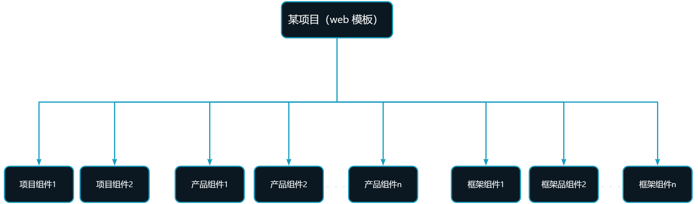

> 📖 **原文档地址**: [点击查看线上文档](http://192.168.219.170/docs/vue/latest/frame/guides/base/component-system/)

框架从 1.1 版本开始，对前端架构采用组件化的形式进行了重构。在新的模式下，一个项目由多个功能内聚的组件包构成，每个组件包
都是一个独立的 npm 包，可以独立开发、测试、发布和维护。

## 为什么要组件化

传统的单体应用开发模式存在以下问题：

- **代码耦合度高**：所有业务代码都在一个工程中，模块间边界不清晰
- **维护困难**：随着项目规模增大，代码难以维护和重构
- **无法复用**：相同的功能在不同项目中需要重复开发
- **团队协作困难**：多人协作时容易产生代码冲突

组件化开发模式的优势：

- **模块化解耦**：每个组件包职责单一，功能内聚
- **独立开发**：不同团队可以并行开发各自的组件包
- **高度复用**：组件包可以在多个项目中复用
- **易于维护**：组件包可以独立维护和升级
- **按需加载**：可以根据项目需要选择性引入组件包

## 组件化架构



在组件化架构中，项目由以下几部分组成：

### 核心层

提供框架的核心能力，包括基础组件、工具方法、路由管理、状态管理等。所有业务开发都需要依赖核心层。

- **PC 端**：`@epframe/eui-core`
- **移动端**：`@epframe/eui-core-m`

### 启动层（Web 工程）

作为应用的启动入口，负责整合各个组件包，配置路由、状态管理、主题等。**不建议在此层编写业务代码**。

- **PC 端模板**：`web`
- **移动端模板**：`ejs.m8.mobileframe.next`

### 业务层（组件工程）

实际的业务代码都在这一层开发。根据业务模块划分为不同的组件包，每个组件包可以独立开发和发布。

- **PC 端模板**：`componentization`
- **移动端模板**：`ejs.m8.componentization`

## PC Web 组件化包

### 核心包：@epframe/eui-core

`@epframe/eui-core` 是 PC 端开发的基础包，提供了以下核心能力：

#### 基础组件

- 表单组件（EpInput、EpSelect、EpDatePicker 等）
- 布局组件（EpLayoutManager、EToolbarSearch、EToolbarTitle 等）
- 展示组件（EpDataGrid、EpVerifyCode、EpFileUploadService 等）

#### 核心功能

- **路由管理**：基于 Vue Router 的路由封装
- **工具方法**：常用的工具函数和辅助方法
- **数据模型**：统一的数据模型管理方案
- **权限控制**：基于角色的权限控制

#### 安装使用

```bash
pnpm add @epframe/eui-core
```

```js
import { Hooks, Routers, setup, Stores, Themes, Utils } from '@epframe/eui-core';
```

### Web 模板

`web` 模板用于创建 PC 端 Web 应用的启动工程。

#### 职责

- 作为应用的入口，整合各个组件包
- 管理全局路由、主题等
- 配置项目的构建和部署

#### 创建方式

```bash
eui-cli web
```

#### 目录结构

部分结构如下：

```
demo-web/
├── src/
│   ├── assets/          # 静态资源
│   ├── router/          # 路由配置
│   ├── App.vue          # 根组件
│   ├── main.js          # 入口文件
│   ├── config.js        # 配置文件
│   └── setup.js         # 组件包引入配置
├── public/              # 公共资源
├── package.json         # 组件依赖配置
└── vite.config.js       # 构建配置
```

> **⚠️ 警告**
>
> 1. 重要提示 Web 工程是启动入口，**不建议在此工程中编写业务代码**。业务代码应该在组件工程中开发。
> 
> 2. 组件打包时不会包含 src/main.js 文件，因此需要发布的相关代码应编写在 src/setup.js 文件中；仅用于开发阶段的代码可放在
>    src/main.js 文件内。

### Componentization 模板

`componentization` 模板用于创建 PC 端组件包，所有业务代码都在组件包中开发。

#### 职责

- 开发具体的业务页面和组件
- 封装可复用的业务逻辑
- 提供独立的功能模块

#### 创建方式

```bash
eui-cli comp
```

#### 目录结构

部分结构如下：

```
demo-study-views/
├── src/
│   ├── views/           # 页面文件
│   ├── components/      # 组件文件
│   ├── utils/           # 工具函数
│   ├── router/          # 路由配置
│   ├── store/           # 状态管理
│   └── index.js         # 入口文件
├── package.json
└── vite.config.js
```

#### 组件包类型

根据功能不同，组件包可以分为：

1. **业务页面包**：包含完整的业务页面，如 `demo-study-views`
2. **业务组件包**：包含可复用的业务组件，如 `demo-study-components`
3. **工具函数包**：包含通用的工具函数，如 `demo-study-utils`

## 移动 Web 组件化包

### 核心包：@epframe/eui-core-m

`@epframe/eui-core-m` 是移动端开发的基础包，提供了移动端特有的核心能力。

#### 核心功能

- **移动端组件**：适配移动端的 UI 组件
- **触摸手势**：支持各种触摸手势操作
- **移动端工具**：移动端特有的工具方法
- **适配方案**：移动端的屏幕适配方案

#### 安装使用

```bash
pnpm add @epframe/eui-core-m
```

### 移动 Web 模板

`ejs.m8.mobileframe.next` 模板用于创建移动端 H5 应用的启动工程。

#### 职责

- 作为移动端应用的入口
- 配置移动端路由、状态管理等
- 配置移动端特有的功能（如手势、适配等）

> **⚠️ 警告**
>
> 重要提示移动 Web 工程是启动入口，组件化开发模式下**不建议在此工程中编写业务代码**。

### 移动组件化模板

`ejs.m8.componentization` 模板用于创建移动端组件包。

#### 职责

- 开发移动端业务页面和组件
- 封装移动端特有的业务逻辑

## 工程组织最佳实践

### 单仓库管理（Monorepo）

推荐使用 Monorepo 方式管理多个组件包，便于统一管理和协作开发。

```
project-root/
├── demo-web/              # Web 启动工程
├── demo-study-views/      # 业务页面包
├── demo-study-components/ # 业务组件包
├── demo-study-utils/      # 工具函数包
├── package.json           # 根 package.json
└── pnpm-workspace.yaml    # workspace 配置
```

### 组件包命名规范

- **业务页面包**：`{项目名}-views`，如 `demo-study-views`
- **业务组件包**：`{项目名}-components`，如 `demo-study-components`
- **工具函数包**：`{项目名}-utils`，如 `demo-study-utils`
- 统一使用 kebab-case（小写+中划线）命名

### 组件包职责划分

遵循**单一职责原则**，每个组件包只负责一个具体的业务模块：

```
✅ 推荐：按业务模块划分
- user-management-views      （用户管理模块）
- order-management-views      （订单管理模块）
- product-management-views    （产品管理模块）

❌ 不推荐：所有业务放在一个包中
- business-views              （包含所有业务）
```

### 组件包依赖管理

#### 依赖层级

```
Web 工程
  ↓ 依赖
组件包（业务层）
  ↓ 依赖
核心包（@epframe/eui-core）
```

#### 依赖原则

- Web 工程可以依赖任何组件包
- 组件包之间可以相互依赖（需避免循环依赖）
- 所有工程都需要依赖核心包
- **PC 端和移动端的包不可混用**

> **⚠️ 警告**
>
> 如下，防止循环依赖的场景，组件包中的通用组件可以放在 `peerDependencies`中，然后在 web 工程中的 `dependencies` 安装该组件
> 依赖
> 
> ```json
>  "peerDependencies": {
>     "@epframe/demo-common-components": "workspace:*",
>     "@epframe/eui-core": "^2.2.10",
>     "@epoint-fe/eui-components": "^1.1.1",
>     "@epoint-fe/eui-hooks": "^1.1.15",
>     "@epoint-fe/eui-icons": "^1.0.3",
>     "@epoint-fe/utils": "^1.1.15",
>     "pinia": "2.2.6",
>     "pinia-plugin-persistedstate": "3.2.0",
>     "vue": "3.5.11",
>     "vue-router": "4.4.5"
>   }
> ```

### 版本管理策略

#### 开发阶段

使用 `workspace:*` 协议，引用工作区内的包：

```json
{
  "dependencies": {
    "demo-study-views": "workspace:*"
  }
}
```

#### 发布阶段

指定明确的版本号：

```json
{
  "dependencies": {
    "demo-study-views": "^1.0.0"
  }
}
```

## 开发流程

### 1. 创建 Web 工程

```bash
# PC 端
eui-cli web
```

### 2. 创建组件工程

```bash
# PC 端组件
eui-cli comp
```

### 3. 在 Web 工程中引入组件包

在 `package.json` 中添加依赖：

```json
{
  "dependencies": {
    "demo-study-views": "workspace:*"
  }
}
```

在 `setup.js` 中注册：

```js
import DemoStudyViews from 'demo-study-views';

export const setup = Utils.defineSetup({
  deps: [DemoStudyViews]
});
```

### 4. 在组件包中开发业务

在组件工程的 `src/views/` 目录下创建页面，在 `src/components/` 目录下创建组件。

### 5. 配置路由和菜单

在后台管理系统的模块管理中配置菜单，或在组件包的 `router/static.js` 中配置前端路由。

## 常见问题

### PC 端和移动端能否混用？

**不可以**。PC 端和移动端的核心包、模板、组件包都是独立的，不能混用：

- PC Web 工程只能加载 PC 组件工程
- 移动 Web 工程只能加载移动组件工程

如果需要同时开发 PC 端和移动端，需要创建两套独立的工程。

### 组件包之间如何共享代码？

可以创建独立的工具函数包或公共组件包，供其他组件包引用：

```js
// 在组件包中引入工具函数包
import { formatDate } from 'demo-study-utils';
```

### 如何避免组件包之间的循环依赖？

- 明确组件包的依赖层级，避免相互依赖
- 将公共代码抽取到独立的基础包中

如下，防止循环依赖的场景，组件包中的通用组件可以放在 `peerDependencies`中，然后在 web 工程中的 `dependencies` 安装该组件
依赖

```json
 "peerDependencies": {
    "@epframe/demo-common-components": "workspace:*",
    "@epframe/eui-core": "^2.2.10",
    "@epoint-fe/eui-components": "^1.1.1",
    "@epoint-fe/eui-hooks": "^1.1.15",
    "@epoint-fe/eui-icons": "^1.0.3",
    "@epoint-fe/utils": "^1.1.15",
    "pinia": "2.2.6",
    "pinia-plugin-persistedstate": "3.2.0",
    "vue": "3.5.11",
    "vue-router": "4.4.5"
  }
```

### 组件包如何独立开发和调试？

需依赖 web 工程

见[跨工程共享](../getting-started/getting-started-write-component.md#kua_gong_cheng_gong_xiang-2)