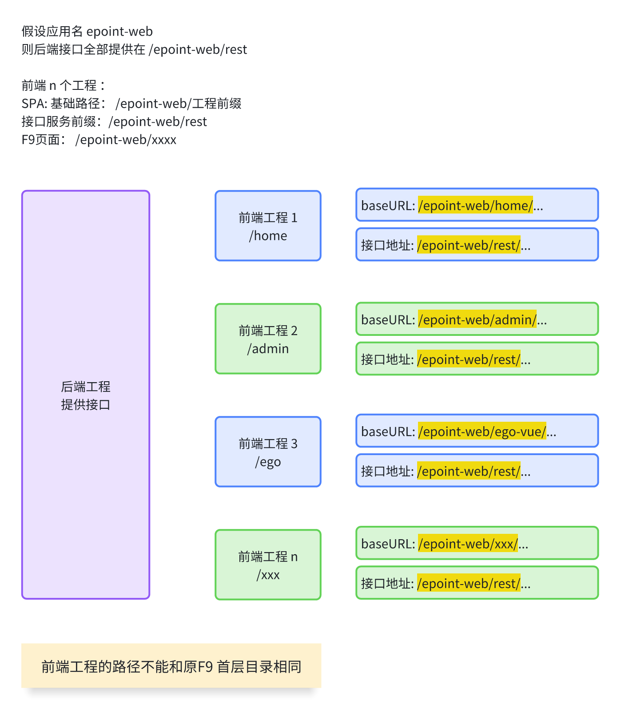

> 📖 **原文档地址**: [点击查看线上文档](http://192.168.219.170/docs/vue/latest/frame/guides/base/web-struct/)

目前前端 Web 工程架构如下图所示：



首先拆分为 2 个场景：

**产品和项目的开发**

只关注一个 web 工程，即面向用户端的 web 工程，（如果涉及移动端则是 2 个 web 工程）， 后台管理工程和低代码（ego）工程，正常无需关注，统一使用框架发布的即可。

**框架开发人员**

需要关注多个 web 工程，可能需要同时以源码形式启动 用户侧、管理侧、低代码侧和移动端的 web 工程。

## 产品和项目的开发

由于大部分的情况无需关注其他 web 工程的源码，正常来说只需要在自己的 web 工程启动的时候能访问到其他 web 工程的页面即可。

方案设计：

1. 仅需要启动一个（或 2 个） web 工程，即面向用户的这一个。（更准确的说是需要引入自己的其他组件的那个 web 工程）
2. 提供一个配置文件，描述自己需要哪些其他 web 工程。（后端管理的和低代码的） （更本质的表达是自己不需要开发，但需要在开发和部署阶段能访问的其他 web 工程）
3. 插件自动获取其他 web 工程，按照当前工程的配置进行构建。 开发阶段进行静态资源挂载，部署阶段自动构建子工程并合并进入当前工程的 dist 下。

以上能力由 [`@epframe/vite-plugin-ext-web`](http://192.168.217.8/febase/vue/vite-plugins/vite-plugin-ext-web) 插件提供。

### 使用说明

要求主 web 工程下提供一个配置文件 `.ext-web.config.mjs`, 框架的web工程均已集成， 范例如下：

```js
/** @type {ExtWebConfigItem[]} */
export const extWebConfig = [
  {
    // 后台管理工程（来自 git）
    name: 'admin',
    path: 'admin',
    git: 'http://192.168.0.200/frame-public-group/web/web-admin',
    branch: 'develop'
  },
  {
    // 低代码 web 工程（来自 npm 包）
    name: 'ego',
    path: 'egoapp',
    npm: '@epframe/web-ego@snapshot-10.0.0'
  }
];
/**
 * @typedef {Object} ExtWebConfigItem
 * @property {string} name - 配置项的名字，用来区分
 * @property {string} path - 子路径名称。标识此工程最终的子路径
 * @property {string} [git] - git 仓库地址（与 npm 二选一）
 * @property {string} [branch] - git 分支
 * @property {string} [npm] - NPM 包规范名，如 "@scope/pkg@1.0.0" 或不带版本（取最新）
 */
```

字段说明：

- `name`: 配置项的名字，用来区分，仅用于展示。
- `path`: 子路径名称。标识此工程最终的子路径。 eg： home、admin、egoapp。 对应 ：`/<应用名>/<path>/` 中的 path 部分。
- `git`: git 仓库地址（与 npm 二选一）
- `branch`: git 分支(git 字段存在时有效)
- `npm`: NPM 包规范名 (注意，web 工程的 npm 包也是发布的源码)
  - 格式 1： `包名`，拉正式版的最新版 eg： `@epframe/web-home`
  - 格式 2： `包名@版本号`，拉给定的版本 eg： `@epframe/web-home@10.0.0-SNAPSHOT.1`
  - 格式 3： `包名@tag`，拉给定 tag 的的最新版本 eg： `@epframe/web-home@snapshot-10.0.0`

作用流程：

开发阶段：

1. 插件根据配置，自动获取其他 web 工程的源码，放在当前web工程的 `sub-packages` 目录下。
2. 逐个识别这些源码中的包管理器，进行依赖安装。
3. 读取主工程的配置， 获取 AppName，插件拼装构建命令，逐个对子工程进行构建。
4. 根据配置，创建静态资源中间件， 把 `/应用名/子工程名/` 的请求指向 `sub-packages` 目录下的子工程的 dist 目录。
5. 此时 vite dev 正常启动：
   1. `/应用名/主工程名/`， 使用主工程的源码，访问正常。
   2. `/应用名/子工程名/`， 使用子工程的 dist 目录，访问正常。

```log
[ext-web] [INFO] dev 阶段: 准备子包
[ext-web] [INFO] 处理子包: admin (sub-packages/epframe-web-admin-snapshot-10.0.0)
[ext-web] [INFO] 处理子包: admin 完成。
[ext-web] [INFO] 处理子包: ego (sub-packages/epframe-web-ego-snapshot-10.0.0)
[ext-web] [INFO] 开始执行 npm 下载，命令: npm pack @epframe/web-ego@snapshot-10.0.0 --json --silent
[ext-web] [INFO] 解压开始: sub-packages/epframe-web-ego-10.0.0-SNAPSHOT.2.tgz -> sub-packages/epframe-web-ego-snapshot-10.0.0
[ext-web] [INFO] 解压完成: sub-packages/epframe-web-ego-snapshot-10.0.0
[ext-web] [INFO] 执行: pnpm install (cwd=vue-web/sub-packages/epframe-web-ego-snapshot-10.0.0) => 安装依赖(ego)
...
[ext-web] [INFO] mount: /epoint-web/admin -> sub-packages/epframe-web-admin-snapshot-10.0.0/dist/epoint-web/admin
[ext-web] [INFO] mount: /epoint-web/egoapp -> sub-packages/epframe-web-ego-snapshot-10.0.0/dist/epoint-web/egoapp
[ext-web] [INFO] mount: /epoint-web/mobile -> sub-packages/epframe-web-mobile-snapshot-10.0.0/dist/build/h5
[ext-web] [INFO] 子包挂载完成: /epoint-web/admin/, /epoint-web/egoapp/, /epoint-web/mobile/
```

构建阶段：

代码获取、安装、构建等流程和开发阶段一致，额外步骤：

等待主工程构建完成后，插件自动将各个子工程的 dist 目录合并拷贝到主工程的 dist 目录下。

### 命令行使用

默认情况建议使用上面的插件形式，插件自动会在 vite 的 dev 和 build 阶段进行介入，开发人员只需要提供配置文件，其他一切由插件自动完成。

> 请注意： cli 命令只会影响子工程的权限拉取与构建行为，不会动主工程。
>
> web 工程安装过 @epframe/vite-plugin-ext-web 插件才会有执行命令 `ext-web`，可以使用这个命令来管理子工程。（web 工程默认已安装）

安装后提供可执行命令 `ext-web`：

直接运行，cli 将会获取主工程下的 `src/config.js` 文件获取 AppName。

```bash
npx ext-web rebuild ego    # 仅重新构建 全部子工程
npx ext-web rebuild ego    # 仅重新构建 ego 这个子工程
npx ext-web purge          # 彻底清理并重新获取、按需安装与构建， 也就是执行完整流程， 包含子工程的获取、安装、构建。
```

### 注意事项

如果你不需要启动其他的子工程， 那么修改 `.ext-web.config.mjs` 文件，保留导出空数组即可。

由于 web 工程发布的都是源码，需要进行依赖安装和构建才能正常使用。

如果你使用工作区，务必确认不得在 `pnpm-workspace.yaml` 下 `packages` 和 工作区的 `package.json` 下 `workspaces` 排除掉子工程的目录。

## 框架开发人员

针对框架开发人员，需要关注多个 web 工程，可能需要同时以源码形式启动 用户侧、管理侧、低代码侧和移动端的 web 工程。

### 技术方案

1. 提供一个 web-all 工程，具备一个配置文件 `.web-all.config.mjs`，可以指定要拉取和启动哪些子的 web 工程。
2. 工程内置脚本( `scripts` 目录下)，可自动拉取相关的工程。
3. 工程启动的时候自动把所有子工程启动。
4. 工程再起一个总的代理， 按照路径代理到子的 web 工程上，保持一个地址和端口访问到全部的功能。

```sh
web-all
    ├─ .web-all.config.js    # 配置文件
    ├─ vite.config.js        # web-all 代理 vite 配置文件
    └─ sub-packages
        ├─ web-home              # 用户侧 3001
        ├─ web-admin             # 管理侧 3002
        ├─ web-ego               # 低代码侧 3003
        └─ web-mobile            # 移动端  3004
```

假设后端应用名为 `epoint-web`, 如上图结构， 几个分别启动在 3001 ~ 3004 端口下， 则访问路径：

- home： `http://localhost:3001/epoint-web/home/`
- admin： `http://localhost:3002/epoint-web/admin/`
- ego： `http://localhost:3003/epoint-web/egoapp/`
- mobile： `http://localhost:3004/epoint-web/mobile/`

外面的 web-all 工程则启动一个 3000 端口的监听， 按照路径分别代理到各个子工程上

- home： `http://localhost:3000/epoint-web/home/` proxy 到 `http://localhost:3001/epoint-web/home/`
- admin： `http://localhost:3000/epoint-web/admin/` proxy 到 `http://localhost:3002/epoint-web/admin/`
- ego： `http://localhost:3000/epoint-web/egoapp/` proxy 到 `http://localhost:3003/epoint-web/egoapp/`
- mobile： `http://localhost:3000/epoint-web/mobile/` proxy 到 `http://localhost:3004/epoint-web/mobile/`

### 使用介绍

拉取 [web-all](http://192.168.0.200/frame-public-group/web/web-all) 工程， 执行 `pnpm run dev` 和 `pnpm run build` 命令， 即可启动/构建 web-all 工程。

## web 工程到后端的代理方案说明

由于目前是 vue 的页面和传统的 html 页面共存，在开发阶段我们希望能够同时访问到新工程的页面和旧工程的页面，vite 的代理配置和常规的接口代理配置有所不同。

我们推荐和方案如下：

### 普通的 web 工程中(包括ext-web)

1. `/<应用名>/子路径` 为 vite 驱动
2. `/<应用名>/<ext-web配置的子工程路径>` 路径为静态资源挂载（例如： `/<应用名>/admin` 、`/<应用名>/egoapp` ）
3. `/<应用名>/rest` 代理到后端
4. `/<应用名>/*` 全部代理到后端（代理中额外针对 1 、2放行）

<details>
<summary>配置范例</summary>

```js
function buildProxyForServer() {
  const config = {};

  // 后端接口代理
  config[`${Config.rootPath}/rest`] = {
    target: BACKEND_SERVER_URL,
    ws: true,
    changeOrigin: true,
    rewrite: proxyRewrite
  };

  // 应用名全部代理
  config[`${Config.rootPath}`] = {
    target: BACKEND_SERVER_URL,
    changeOrigin: true,
    rewrite: proxyRewrite,
    // 额外排除本工程和子 web
    bypass: (req) => {
      // 当前工程的 base 不走代理
      if (req.url.startsWith(`${Config.basePath}`)) {
        // console.log('🚀 本工程base不走代理:', req.url);
        return req.url;
      }
      // 所有子 web 不走代理
      if (typeof extWebConfig !== 'undefined' && Array.isArray(extWebConfig) && extWebConfig.length) {
        for (const webItem of extWebConfig) {
          if (req.url.startsWith(`${Config.basePath}/${webItem.path}`)) {
            // console.log('🚀 子 web 不走代理:', req.url);
            return req.url;
          }
        }
      }
    }
  };

  console.log(`到后端的代理配置:\n`, config);

  return config;
}
```

</details>