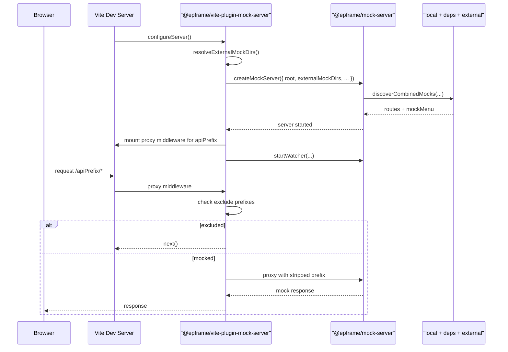

# mock 仓库架构与运行机制

本文档说明 `@epframe/mock-server` 和 `@epframe/vite-plugin-mock-server` 的职责分工，以及当前 mock 发现、合并、代理和热更新机制。

## 1. 分层

### `@epframe/mock-server`

运行时核心，负责：

- mock 发现
- 路由合并
- 请求处理
- 菜单收集
- Dashboard
- 状态接口
- 热更新目标重载

### `@epframe/vite-plugin-mock-server`

Vite 集成层，负责：

- 在 `serve` 阶段启动 `@epframe/mock-server`
- 管理生命周期
- 注入 `apiPrefix` 代理中间件
- 通过 `exclude` 放行指定前缀
- 根据 `externalMockRoot` 自动发现外部 F9 mock
- 调用 `startWatcher(...)`

## 2. 启动链路

## 3. 发现机制

### 宿主标准发现

`discoverMocks(projectRoot)` 会加载：

1. 宿主根目录本地 `mock/index.*`
2. 宿主 `package.json` 的 `dependencies` / `devDependencies`
3. 每个依赖里显式导出的 `包名/mock`

注意：

- 不是扫描整个工作区
- 业务包必须导出 `./mock`
- 宿主必须真的依赖该包

### 外部 F9 mock 发现

插件层支持两种方式：

- `externalMockRoot`
- `externalMockDirs`

其中推荐优先使用 `externalMockRoot`。插件会从这个目录开始递归扫描，识别符合以下结构的项目：

- `src/main/webapp`
- `src/main/resources/META-INF/resources`

只要发现其中任一目录存在，就认为该目录是一个 F9 项目根目录；如果同级存在 `mock/`，则自动纳入外部 mock 列表。

### 合并行为

外部 mock 不会替代宿主本地 mock 和依赖包 mock。  
当前运行时会统一加载：

- external mock
- 宿主本地 mock
- 依赖包 mock

然后统一做优先级合并。

## 4. 路由合并规则

路由唯一键为：

- `method + url`

冲突时保留：

- `priority` 更高者

默认优先级：

- 依赖包：`mockConfig.basePriority ?? 0`
- 宿主本地：`mockConfig.basePriority ?? 100`
- 外部 F9 mock：`origin === 'local' ? 100 : 0`

## 5. 请求处理模型

### `body`

- 适合固定结构和 Mock.js 模板
- 自动包装标准成功响应

### `response(req)`

- 适合依赖请求参数的逻辑
- 自动包装标准成功响应

### `handler(req, res)`

- 完全控制底层响应
- 不自动包装

## 6. 菜单与状态接口

如果 mock 模块导出 `mockMenu`，发现阶段会同时收集。

当前运行时仍然负责：

- 菜单收集
- 菜单格式化

这部分后续会继续解耦，方向是：

- `mock-server` 保留 raw 菜单收集
- 具体接口层各自负责最终格式化

状态端点：

- `GET /__dashboard__`
- `GET /__api__/status`

## 7. 热更新

`startWatcher(mockServer, projectRoot, { externalMockDirs })` 会同时监听：

- 宿主本地 `mock/`
- 依赖包真实 `mock/` 路径
- 外部 F9 `mock/`

文件变化后会重新执行整套发现和合并流程，而不是做单路由局部替换。

## 8. F10/F9 混合模式

混合模式里推荐的职责划分是：

- F10 主入口拥有 `/rest` mock ownership
- F9 页面由 `f9server` 提供
- F10 通过 `externalMockRoot` 把 F9 mock 一起注入自己的 mock-server

特别注意：

- `/epoint-web/rest/resource/*` 这类 F9 boot 资源不应进入 mock 代理
- 应通过插件的 `exclude` 配置把它们放行，让请求回到宿主的正常后端代理链

## 9. 边界

- npm 发布内容当前仍是 TS 源码入口
- 当前包没有稳定 CLI
- 菜单 raw/format 解耦还未完成
- 外部 F9 mock 发现当前面向本地开发目录，不覆盖 JAR 内 mock

## 10. 相关文档

- [根入口 README](../README.md)
- [接入迁移文档](./integration-migration.md)
- [Mock 数据编写手册](./mock-server-user-guide.md)
- [F9 Mock 指南](./f9-mock-guide.md)
